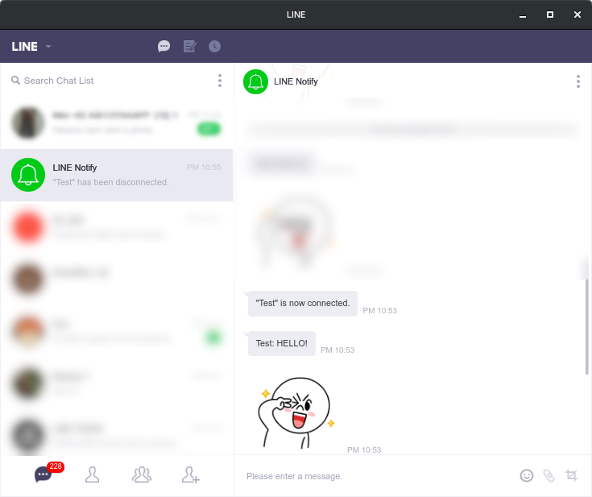

# line-notify-sdk-php

Line Notify SDK Client for PHP. Generate Auth URL, resolve authcode to token, and send messages directly.

# About the LINE API
See the official API documentation for more information.

English: [notify-bot.line.me/doc/en](https://notify-bot.line.me/doc/en)

Japanese: [notify-bot.line.me/doc/ja/](https://notify-bot.line.me/doc/ja/)

# Getting Started
## Installation
Use [Composer](https://getcomposer.org) to pull this library.
```shell
$ composer require chez14/line-notify-sdk
```

## Create a Channel 
1. Create a LINE Notify Client, go to [LINE Notify Service Creator](https://notify-bot.line.me/my/services/new), and register new Service.
2. Go to [LINE Notify Service Manager](https://notify-bot.line.me/my/services/), open your service, and grab the Client Secret and Client ID.

## Creating API Instance

Create a new object from `LINE\Notify\Api`. Don't forget to supply both `client_id` and `client_secret` to the parameter.

```php
$api = new LINE\Notify\Api([
    "client_id" => '0123456789',
    "client_secret" => '00112233445566778899aabbccddeeff'
]);
```

After that, you can use your get your auth code, and do some OAuth job.
```php
$login = LINE\Notify\Token::generateAuthUrl($api, "http://localhost:8087/oauthcallback.php", "stateA");
// will produce:
// https://notify-bot.line.me/oauth/authorize?response_type=code&client_id=0123456789&redirect_uri=http%3A%2F%2Flocalhost%3A8087%2Foauthcallback.php&scope=notify&state=stateA

// On oauthcallback.php
$token = LINE\Notify\Token::fromAuthCode($lineApi, $_GET['code'], "http://localhost:8087/oauthcallback.php");
$api->setToken($token);

$notify = new LINE\Notify\Notify($api);
$notify->notify("HELLO!", null, 1, 106);
```
That, will produce something like:



Check our documentation page to get more info about this library classes, and
see our [`examples` folder](examples/) to get more examples.

## Go beyond, and plus ultra!
Check this API Documentation (tbd), and check LINE Notify Bot's corresponding documentations.

Have fun!


# License
[MIT](LICENSE).

# Bug Report
Please, if you have any feedback or bug report for this lib, submit it to
the issue tracker. If you concern about the security and privacy, you can
PGP-encrypt it using [Chez14's Keybase](https://keybase.io/encrypt#chez14),
and submit it as an issue.